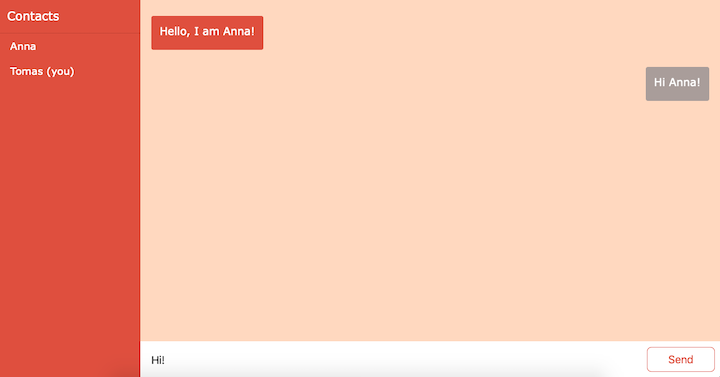

# CHAT CLIENT

Right now it doesn't do much. 
You can write new message to Anna but she is on vacation right now, so she will probaly won't respond you. :)

# Instalation instructions
* npm install
* npm run start to start in dev mode
* 'npm run'...
* ...ready to go!